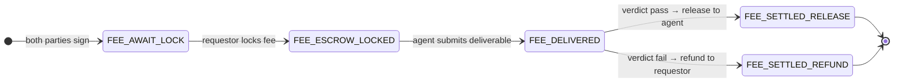

# Fee Track

The fee track manages the primary transaction through escrow. It is active in every job and provides the core guarantee: the counterparty (business agent) gets paid only after an independent evaluator confirms delivery quality.

## Lifecycle

The fee track progresses through five states:

**FEE_AWAIT_LOCK** is the initial state after both parties sign the agreement. The requestor must lock the fee before any work begins.

**FEE_ESCROW_LOCKED** means the fee amount is held in escrow. The business agent can now begin work. The lock produces a `lock_ref` that tracks the escrowed deposit.

**FEE_DELIVERED** means the business agent has submitted a deliverable (referenced by `deliverable_ref`, e.g., an IPFS hash or order confirmation). The evaluator can now assess quality.

**FEE_SETTLED_RELEASE** is the terminal state when the evaluator issues a `pass` verdict and the fee is released to the business agent (payee).

**FEE_SETTLED_REFUND** is the terminal state when the evaluator issues a `fail` verdict and the fee is refunded to the requestor (payer).

## Settlement Rules

The settlement action must match the evaluation verdict. A `pass` verdict requires a `release` action. A `fail` verdict requires a `refund` action. The server enforces this and rejects mismatched actions with a 400 error.

## Automatic Collateral Handling

When collateral is locked (via the principal track), fee settlement automatically handles it. There is no separate collateral settlement step. On `release` (pass verdict), the server unlocks collateral and returns it to the business agent. On `refund` (fail verdict), the server slashes collateral to the requestor (the harmed party). This ensures collateral is always resolved alongside the fee, preventing orphaned deposits.

## Ordering Constraints

The state machine enforces strict ordering:

1. Fee cannot be locked until both parties have signed the agreement (TRANSACTION phase).
2. Deliverable cannot be submitted until the fee is locked.
3. Evaluation cannot happen until a deliverable is submitted.
4. Fee cannot be settled until evaluation is complete.
5. Fee cannot be settled twice.

## Role Permissions

| Action | Required Role |
|--------|--------------|
| Lock fee | Requestor |
| Submit deliverable | Business Agent |
| Evaluate | Evaluator |
| Settle fee | Any party |

## Integration with Mandates

In AP2-ARS, the fee track has an additional gate: when a mandate exists, the fee lock is blocked until the mandate reaches `PAYMENT_SIGNED`. This ensures the authorization layer (mandate) completes before any funds are escrowed. The escrowed amount in AP2-ARS is the cart total from the mandate, and the payee is the merchant. See [Transaction Flow](../ap2-integration/transaction-flow.md) for the complete integrated flow.
