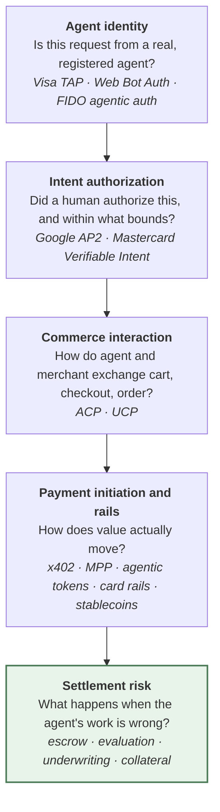

# Agentic Commerce Protocol Landscape

*Survey current as of August 2026. Every claim below links to a primary or reported source;
re-check dates and versions before relying on them, because this space is moving fast.*

ARS ships two concrete implementations — [AP2](ap2-integration/overview.md) and
[VI](vi-integration/overview.md) — but those are two entries in a field that has grown to roughly a
dozen overlapping specifications since late 2025. This page maps the field, explains which layer
each specification occupies, and identifies where ARS fits. It is a positioning document, not a
roadmap commitment.

## The layer cake

Almost every announcement in this space is described as "a protocol for agentic payments," but the
specifications occupy four distinct and largely non-competing layers:

The first four layers are well covered. The fifth is not, and that is the layer ARS occupies.

Every specification below answers some version of *may this transaction proceed?* None of them
answers *what happens after the money moves and the delivery turns out to be wrong?* They
authorize, identify, and settle; they do not hold funds pending an independent verdict, they do not
define an evaluator role, and they do not price or collateralize agent counterparty risk. ARS is
deliberately downstream of all of them: any of these protocols can serve as the authorization layer
feeding the ARS fee and principal tracks, exactly as AP2 and VI already do.

## Layer 1 — Agent identity

### Visa Trusted Agent Protocol (TAP)

Announced by Visa and Cloudflare on **14 October 2025** with twelve launch partners (Adyen, Ant
International, Checkout.com, Coinbase, CyberSource, Elavon, Fiserv, Microsoft, Nuvei, Shopify,
Stripe, Worldpay). TAP answers a single question cryptographically: *is this agent legitimate?*

Mechanically it is the closest specification in the field to how ARS already works:

- **RFC 9421 HTTP Message Signatures**, built on the emerging Web Bot Auth work, carried in
  request headers.
- **Ed25519 signatures** — the same curve ARS uses for `SignedActionEnvelope` — verified against a
  Visa-operated directory of agent public keys.
- **Replay resistance** through a signed timestamp, a unique session identifier, a key identifier,
  and an algorithm identifier.
- **Context binding**: a signature is locked to a specific merchant domain, so a valid signature
  captured against one merchant cannot be replayed against another.
- **Verified consumer identifiers** (including Payment Account References) and loyalty data may
  ride along as trusted, pre-filled data.

The spec and a five-component reference implementation are open source at
[visa/trusted-agent-protocol](https://github.com/visa/trusted-agent-protocol).

### FIDO Alliance agentic working groups

On **28 April 2026** the FIDO Alliance formed an Agentic Authentication Technical Working Group and
a Payments Technical Working Group to define how agents authenticate users, verify intent, and
transact on their behalf. Two contributions matter directly to this repository: **Google donated
AP2** and **Mastercard contributed Verifiable Intent** to the Alliance. Both protocols ARS
implements are therefore now on a standards track, which raises the likelihood of breaking
revisions and of the two converging on shared primitives.

## Layer 2 — Intent authorization

### Google Agent Payments Protocol (AP2)

Implemented in this repo as [`ap2/server/`](ap2-integration/overview.md). Three signed mandate
types (Intent, Cart, Payment) establish what to buy and from whom. Now donated to FIDO.

### Mastercard Verifiable Intent (VI)

Implemented in this repo as [`vi/server/`](vi-integration/overview.md). Published jointly by
Mastercard and Google as a **v0.1 draft dated 18 February 2026**, with an open reference
implementation, and launch support from Adyen, Basis Theory, Checkout.com, Fiserv, IBM, and
Worldpay. VI builds on existing FIDO Alliance, EMVCo, IETF, and W3C specifications and is
explicitly designed to work across agentic protocols, devices, wallets, and other payment networks.
Now contributed to FIDO.

The complementarity worth noting: **TAP proves the agent is who it says it is; AP2 and VI prove a
human authorized what the agent is doing.** These are orthogonal, and a production deployment
plausibly wants both.

## Layer 3 — Commerce interaction

### Agentic Commerce Protocol (ACP)

Open standard maintained by OpenAI and Stripe (with Meta), covering checkout, delegated payment,
cart, product feed, orders, authentication, and integration with the Model Context Protocol. Latest
stable specification version **2026-04-17**. PayPal joined as a second compliant payment provider on
28 October 2025; Stripe shipped its Agentic Commerce Suite on 11 December 2025.

### Universal Commerce Protocol (UCP)

Announced by Google at NRF on **11 January 2026**, co-developed with Shopify, Etsy, Wayfair,
Target, and Walmart, and endorsed by 20+ partners including Visa, Mastercard, Stripe, and American
Express. UCP is explicitly **compatible with AP2** for the payments half of the flow — UCP handles
discovery, cart, and checkout; AP2 handles the authorization. Cart and product-discovery
capabilities were added in a March 2026 update.

## Layer 4 — Payment initiation and rails

### x402

Coinbase's HTTP 402 payment scheme over EIP-3009 `transferWithAuthorization`. Already integrated as
the AP2 implementation's settlement rail — see [x402](settlement-rails/x402.md).

### Machine Payments Protocol (MPP)

Co-authored by Stripe and Tempo, launched **18 March 2026** alongside the Tempo mainnet. Like x402
it standardizes HTTP 402, but as a formal `Payment` HTTP authentication scheme proposed to the IETF,
with a challenge → credential → receipt flow that also extends to MCP transports. Crucially, **MPP
is payment-method agnostic**: stablecoins, cards via Stripe, and custom methods all sit behind the
same interface. Specs at [tempoxyz/mpp-specs](https://github.com/tempoxyz/mpp-specs).

### Mastercard Agent Pay and Agent Pay for Machines

Agent Pay was announced **29 April 2025**, built on **Agentic Tokens** — an extension of the
Mastercard Digital Enablement Service that binds a tokenized card credential to a specific agent, a
specific merchant scope, and a specific consent policy, so the agent never holds a raw card number.
Mastercard completed the first live agentic payment transaction on 29 September 2025.

**Agent Pay for Machines** launched **10 June 2026** with 30+ partners (Stripe, Adyen, Coinbase,
Cloudflare, OKX, Ripple, Polygon, Solana), targeting machine-to-machine payments down to fractions
of a cent, with settlement across cards, bank accounts, and stablecoins. Its stated capabilities —
credentialing every agent with verifiable intent, permissioning rules such as spend caps,
continuous multi-party transacting, and guaranteed settlement across rails — are the closest thing
in the field to an adjacent claim on the ARS problem space, and worth watching.

### Visa Intelligent Commerce

Visa's platform for agent transactions: agent-bound tokenized credentials with spend limits, where a
rogue agent's token can be revoked without reissuing the user's card. Notably, Visa accepts payments
initiated via **TAP, MPP, ACP, and UCP** — a useful signal that the interaction and identity layers
are converging on multi-protocol acceptance rather than a single winner. Visa announced a
collaboration with OpenAI on agent-led payments in June 2026.

## Where ARS sits

| Concern | Covered by | Covered by ARS |
|---|---|---|
| Is the agent a registered, non-spoofed actor? | TAP, Web Bot Auth, FIDO | No — consumed as input |
| Did a human authorize this, within what bounds? | AP2, VI | No — consumed as input (implemented for AP2 and VI) |
| How do agent and merchant agree on a cart? | ACP, UCP | No |
| How does value move? | x402, MPP, agentic tokens, card rails | Pluggable via `SettlementLayer` |
| Are funds held until delivery is confirmed? | — | **Yes** — fee track escrow |
| Who independently judges delivery quality? | — | **Yes** — Evaluator role, pass/fail verdict |
| Is counterparty risk priced and collateralized? | — | **Yes** — principal track, premium, collateral |
| What compensates the harmed party on failure? | — | **Yes** — refund and collateral slashing |
| Is the whole exchange independently auditable? | Partially (signed requests) | **Yes** — replayable signed event log |

The bottom four rows are the reason ARS exists. The consistent gap across all twelve-odd
specifications is that they terminate at authorization: once the payment is authorized and
initiated, the protocol is finished, and any dispute falls back to chargebacks and off-protocol
processes designed for human buyers. ARS keeps the funds in escrow past that point and makes
delivery quality a protocol-level event rather than a customer-service outcome.

## Implications for this repository

Three observations follow from the survey, offered as discussion points rather than committed work:

**1. TAP is the cheapest next integration, and it is additive rather than alternative.** TAP already
uses Ed25519 and a canonical signature base with a nonce and timestamp — the same primitives as
`abstract_ars.crypto`. Because it verifies *agent identity* rather than *user intent*, it does not
compete with the existing AP2 and VI credential tracks; it composes with them as a pre-authorization
gate. A minimal integration would verify an RFC 9421 signature at job creation and record the
verified agent identity as an event, so that the audit log shows not just that an agent acted but
that a directory-registered agent acted. That fits the existing extension pattern documented in
[Building Your Own Concrete Implementation](../README.md#building-your-own-concrete-implementation)
without touching the fee or principal tracks.

**2. MPP is a natural second settlement rail.** `abstract_ars.settlement.SettlementLayer` is already
the seam where x402 plugs in. MPP occupies the same HTTP 402 niche but is payment-method agnostic
and on an IETF track, so an `MPPSettlement` implementing the same ABC would let ARS settle over
cards and stablecoins without touching the state machine.

**3. The FIDO donation is a versioning risk worth tracking.** Both protocols this repo implements
are now standards-track contributions rather than vendor specifications. Pinning the implemented
spec version in the AP2 and VI overview docs — and noting VI as v0.1 (18 February 2026) — would make
future drift visible instead of silent.

## Sources

- Visa, [Trusted Agent Protocol announcement](https://investor.visa.com/news/news-details/2025/Visa-Introduces-Trusted-Agent-Protocol-An-Ecosystem-Led-Framework-for-AI-Commerce/default.aspx) and [visa/trusted-agent-protocol](https://github.com/visa/trusted-agent-protocol)
- Cloudflare, [Securing agentic commerce](https://blog.cloudflare.com/secure-agentic-commerce/)
- FIDO Alliance, [Standards for trusted AI agent interactions](https://fidoalliance.org/fido-alliance-to-develop-standards-for-trusted-ai-agent-interactions/); PYMNTS, [Google and Mastercard contribute agentic commerce standards to FIDO](https://www.pymnts.com/news/artificial-intelligence/2026/google-and-mastercard-contribute-agentic-commerce-standards-to-fido-alliance/)
- Mastercard, [How Verifiable Intent builds trust in agentic AI commerce](https://www.mastercard.com/us/en/news-and-trends/stories/2026/verifiable-intent.html) and [Agent Pay for Machines launch](https://www.mastercard.com/us/en/news-and-trends/press/2026/june/mastercard-launches-agent-pay-for-machines.html)
- OpenAI/Stripe, [agentic-commerce-protocol](https://github.com/agentic-commerce-protocol/agentic-commerce-protocol) and [Delegated Payment Spec](https://developers.openai.com/commerce/specs/payment)
- Google, [Under the Hood: Universal Commerce Protocol](https://developers.googleblog.com/under-the-hood-universal-commerce-protocol-ucp/)
- Stripe, [Introducing the Machine Payments Protocol](https://stripe.com/blog/machine-payments-protocol) and [tempoxyz/mpp-specs](https://github.com/tempoxyz/mpp-specs)
- Visa, [Intelligent Commerce](https://www.visa.com/en-us/solutions/intelligent-commerce)
