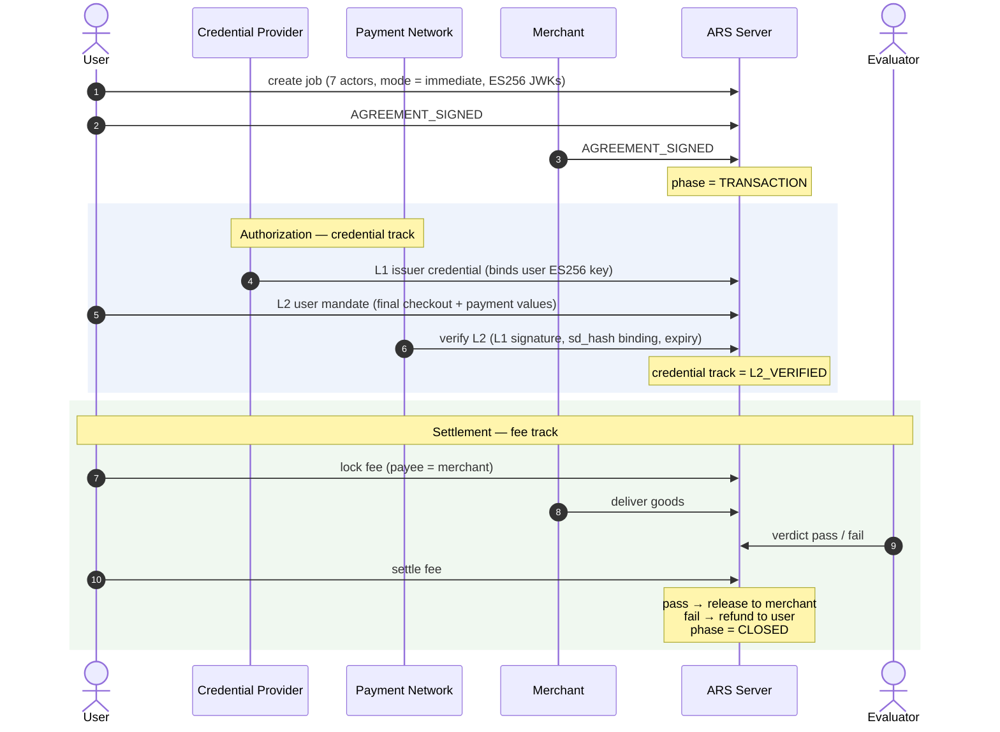
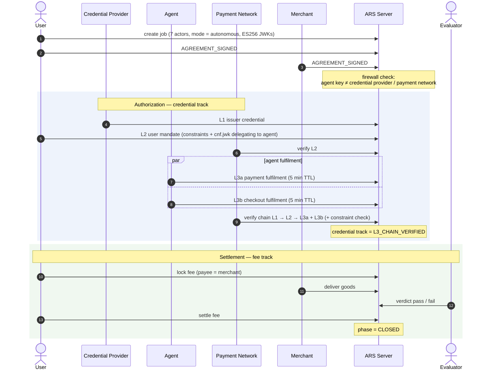
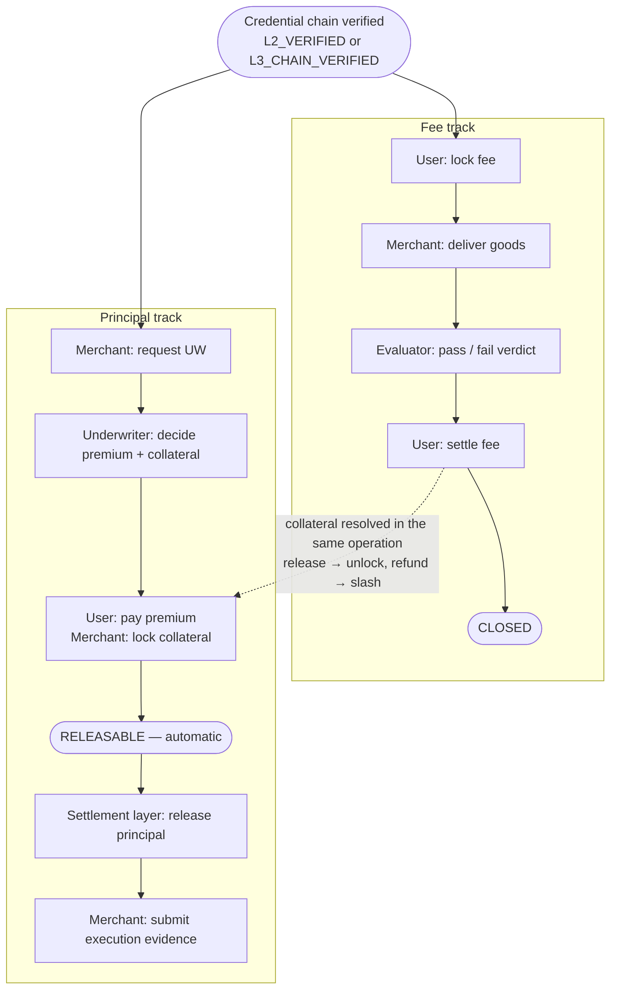

# Transaction Flow

The complete VI-ARS transaction flow has three phases: job setup, credential authorization, and settlement through ARS tracks.

## Phase 1: Job Setup

The User creates a job with a `VIAgreementDraft` specifying all seven actors, the mode (immediate or autonomous), ES256 JWKs for the credential chain, fee terms, and optionally principal terms with an underwriter.

The User and Merchant sign the agreement using Ed25519 (the base ARS signing mechanism). Once both signatures are recorded, the job enters the `TRANSACTION` phase. At this point, both the fee track and (if applicable) the principal track become active, and credential issuance can begin.

The agent-credential firewall is enforced at job creation. If the Agent's key matches the Credential Provider's or Payment Network's key, the job is rejected.

## Phase 2: Credential Authorization

The credential flow establishes what to buy and from whom using SD-JWT credentials:

### Immediate Mode

1. **Credential Provider issues L1** with user identity and ES256 key binding.
2. **User creates L2** with final checkout and payment values (no constraints, no agent delegation).
3. **Credential Provider or Payment Network verifies L2** chain (checks L1 signature, sd_hash binding, expiry).

The credential track reaches `L2_VERIFIED`. The authorization is complete.

### Autonomous Mode

1. **Credential Provider issues L1** with user identity and ES256 key binding.
2. **User creates L2** with constraints (amount bounds, merchant whitelist, payee list, line items) and delegates to the agent via `cnf.jwk`.
3. **Payment Network verifies L2** chain.
4. **Agent creates L3a** (payment fulfillment) with final payment values within L2 constraints.
5. **Agent creates L3b** (checkout fulfillment) with final checkout values within L2 constraints.
6. **Payment Network verifies full chain** (L1 → L2 → L3a + L3b, with constraint checking).

The credential track reaches `L3_CHAIN_VERIFIED`. The authorization is complete.

## Phase 3: Fee Track Settlement

After credential authorization, the fee track handles the actual money movement:

1. **User locks fee escrow.** The escrowed amount is the agreement fee amount. The payee is the merchant.
2. **Merchant delivers goods** by submitting a deliverable reference.
3. **Evaluator evaluates** the delivery and issues a pass or fail verdict.
4. **Fee is settled.** On pass, the escrowed funds are released to the merchant. On fail, they are refunded to the user. If collateral was locked, it is automatically handled: unlocked on pass, slashed on fail.

The job reaches the `CLOSED` phase.

## Phase 3b: Principal Track (Optional)

When the agreement has `requires_principal = true` and includes principal terms and an underwriter:

1. **Merchant requests UW review** after credential authorization.
2. **Underwriter assesses risk** and issues a decision with premium and collateral terms.
3. **User pays premium** or refuses and overrides.
4. **Merchant locks collateral** or refuses and the user overrides.
5. Principal auto-reaches `RELEASABLE` when all conditions are met.
6. **Merchant submits execution evidence** proving the funds were used as intended.

## Enforcement Gates

Two enforcement gates connect the credential layer to the settlement layer:

**Fee lock gate.** When a credential exists (credential track state is not `CREDENTIAL_NONE`), the fee lock is blocked until the credential chain is verified. In immediate mode, this means `L2_VERIFIED`. In autonomous mode, this means `L3_CHAIN_VERIFIED`.

**UW gate.** When credentials exist, UW requests are blocked until the chain is verified. Additionally, UW requests are blocked if `requires_principal` is `false` on the agreement.

## Flow Diagrams

### Immediate Mode

### Autonomous Mode

Selective disclosure applies to the presentations, not to the chain itself: the merchant is served
`GET /jobs/{id}/credentials/present/merchant` (checkout data only) and the payment network is served
`GET /jobs/{id}/credentials/present/network` (payment data only).

### With Principal Track

